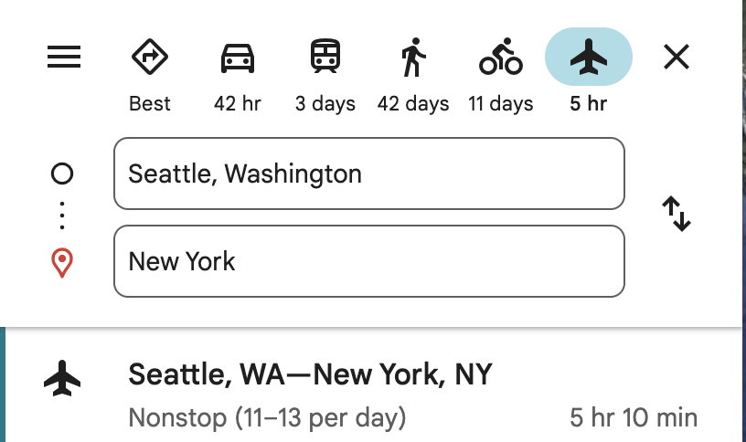
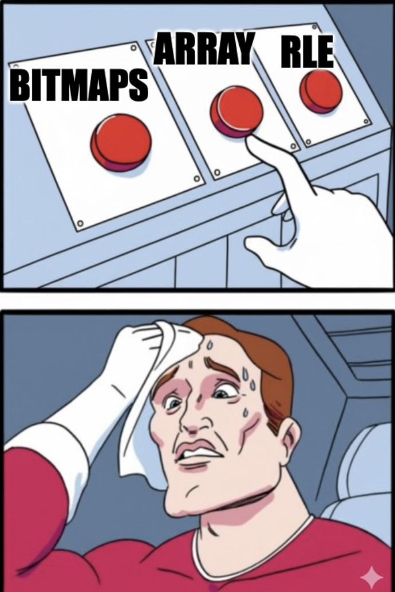

## Travel

Suppose you want to travel from Seattle to New York City. You would (obviously) fly, because walking across the country would be insane. But if you want to go from your apartment in Capitol Hill to Pike Place Market in downtown, you'd probably take a bus and then walk a bit, because calling an Uber to the airport to catch a cross-country flight to go two miles would be, well, equally insane but in the opposite direction.

<table style="margin: 0 auto; border: none;">
  <tr style="border: none;">
    <td style="border: none; padding: 10px; text-align: center;">
      
    </td>
  </tr>
</table>

The best way to get somewhere depends on the _distance_ you're traveling. Nobody uses the same transportation method for every trip. You look at each leg of your journey and pick the method that makes sense for that particular stretch.

## Bitmap

Now suppose you are a newsletter writer with 10 subscribers, and you want to write a program to keep track of how many of those subscribers are paid subscriber. One way to do it is by using a bitmap/ bitset, where you create an array of bits of size 10, and each position (bit) corresponds to a subscriber, and the bit is `1` if the subscriber is a paid subscriber and `0` if not. For example, label your subscribers from 0 to 9. If subscribers #1, #4, #6 and #7 are paid, you'd set those bit positions to 1 and leave the rest 0:

`[0, 1, 0, 0, 1, 0, 1, 1, 0, 0]`

Another way to do it is by creating an array of only paid subscribers, where the array stores the IDs of subscribers who are paid. For example, if subscribers #4, and #7 are paid, you'd store `[4, 7]`. The upside is that when only a small fraction of subscribers are paid, this representation is **more space-efficient** since you only store the paid ones, not 10 slots. The downside is that checking whether subscriber #5 is paid means searching the array (unless you keep it sorted and use binary search).

Now you become a very successful writer with 1 billion subscribers and almost all of your old subscribers are paid subscribers.

The bitmap and the array approach would require 1 billion bits (about 125 MB) and around 1 billion INT (about 4 GB for 32bit INT) - manageable, but large. The sparse array approach would be terrible here because if 999 million out of 1 billion subscribers are paid, you'd need to store 999 million IDs! This is where **Run-Length Encoding (RLE)** shines. Instead of storing each bit individually, RLE compresses sequences by storing the _length_ of consecutive runs of the same value. For example, if you have this bitmap:

`[1, 1, 1, 1, 1, 0, 1, 1, 1, 1] `

RLE would encode it as:

`[(1, 5), (0, 1), (1, 4)]`

which means: "five 1s, then one 0, then four 1s"

With 1 billion subscribers where almost everyone is paid, you might have:

```
[1, 1, 1, ..., 1, 0, 1, 1, ..., 1, 0, 0, 1, 1, ..., 1]
└─  500M 1s  ─┘      └─ 499M 1s ─┘ └─   rest       ─┘
```

RLE could compress this to just a few entries:

```
[(1, 500000000), (0, 1), (1, 499000000), (0, 2), (1, 999997)]
```

Instead of storing 1 billion bits, you only store a handful of (value, length) pairs! This is extremely space-efficient when you have long runs of the same value

So far so good, but real life is messier than this.

Suppose you have 1 billion subscribers but they signed up over time. Your first 100 million subscribers are superfans - almost all of them are paid (dense data, RLE is perfect). Then you went viral on Twitter and got 400 million drive-by subscribers, and only 1% of them converted to paid (super sparse data, array is perfect). Then your most recent 500 million subscribers have about 50% conversion (medium density, bitmap is perfect).

If you use _just_ RLE for everything, you're compressing "1, 0, 1, 0, 1, 0..." in that middle chunk, which is terrible - RLE loves long runs, not alternating bits. If you use _just_ arrays for everything, you're storing 549 million IDs when you could've compressed most of them. If you use _just_ bitmaps for everything, you're using 125 MB when you could do much better.



Similar to our traveling example, the best way to store your data depends on the _density_ of your subscribers. Nobody uses the same storage method for every chunk of data. You look at each segment of your subscriber base and pick the method that makes sense for that particular chunk.


Well this is basically how Roaring Bitmaps store data.

## What is Roaring Bitmaps

Roaring Bitmaps use a two-level system - think of it like a filing cabinet.

On a high level, Roaring Bitmaps divide your data (we'll use 32-bit integers)
into Containers (chunks) and then look at each container and update it to the
most appropriate storage option as data gets updated.

### Level 1: The "Directory" / How does it divide data

Roaring Bitmaps split every 32-bit integer into two 16-bit parts:

```
32-bit integer:  [High 16 bits]      [Low 16 bits]
                      ↓                   ↓
                    "Key"             Stored in
               (to index Containers)   Container
```

- **High 16 bits:** Stored as a key to index Containers
- **Low 16 bits:** Stored in the corresponding Container.

The high 16 bits divide the integer space [0, 2^32) into chunks of **65,536** (2^16) consecutive integers.

- **Container 0:** [0, 65536) → key = 0
- **Container 1:** [65536, 131072) → key = 1
- **...**


**Example:** Let's say you want to store the integer **70,000**.

- **In binary:** 70,000 = `0000 0000 0000 0001 0001 0001 0111 0000`
- **High 16 bits:** `0000 0000 0000 0001` = **1** → This is the container key
- **Low 16 bits:** `0001 0001 0111 0000` = **4,464** → This is what gets stored

So the integer 70,000 gets routed to **Container 1** (because its high bits equal 1),
and the value **4,464** is stored inside that container.

### Level 2: The "Data Storage" / how does it store data

Each container stores up to 65,536 values (the low 16 bits). Roaring Bitmaps dynamically switch between three container types based on data density to optimize memory.

| **Container Type**  | **Optimized For**                             | **Threshold / Logic**                                                                                      |
| ------------------- | --------------------------------------------- | ---------------------------------------------------------------------------------------------------------- |
| **ArrayContainer**  | **Sparse Data**<br>(Cardinality ≤ 4096)       | Uses **binary search** for lookups. Extremely compact for few elements (e.g., 4 items = 8 bytes).          |
| **BitmapContainer** | **Dense Data**<br>(Cardinality > 4096)        | Fixed size of **8KB**. Supports fast bitwise operations (AND/OR/XOR).                                      |
| **RunContainer**    | **Sequential Data**<br>(Long runs of numbers) | Run-Length Encoded (RLE). Example: `{10, 11, 12, 13}` becomes `(10, 3)`. Created only via `runOptimize()`. |

### How to add a value

When you add a value, the system routes the data to the correct container or creates a new one.

Let's look at the [official Java implementation](https://github.com/lemire/RoaringBitmap/blob/b2580c61dea3e3f102a26b70ff3fa6065eabc448/RoaringBitmap/src/main/java/org/roaringbitmap/RoaringBitmap.java#L1061-L1071) to see this routing logic in action

```
public void add(final int x) {
    final short hb = Util.highbits(x);        // 1. Extract high 16 bits
    final int i = highLowContainer.getIndex(hb); // 2. Binary search for key

    if (i >= 0) {
        // 3. Container exists - add low bits to it
        highLowContainer.setContainerAtIndex(i,
            highLowContainer.getContainerAtIndex(i).add(Util.lowbits(x)));
            //3.5 Will auto convert to a different container if threshold is met
    } else {
        // 4. No container - create new ArrayContainer
        final ArrayContainer newac = new ArrayContainer();
        highLowContainer.insertNewKeyValueAt(-i - 1, hb, newac.add(Util.lowbits(x)));
    }
}
```

**Auto-Conversion Logic:**

- **Array → Bitmap:** If an `ArrayContainer` exceeds 4096 elements, it converts to a `BitmapContainer`.
- **Bitmap → Array:** If elements are removed and cardinality drops, it converts back to save memory.
- **→ RunContainer:** Only occurs if explicitly requested via `runOptimize()` or during specific range operations.

Here is the [Java example](https://github.com/lemire/RoaringBitmap/blob/b2580c61dea3e3f102a26b70ff3fa6065eabc448/RoaringBitmap/src/main/java/org/roaringbitmap/ArrayContainer.java#L123-L125) of the Array to Bitmap conversion

```
  @Override
  public Container add(int begin, int end) {
  ...
    if (newcardinality > DEFAULT_MAX_SIZE) {
      BitmapContainer a = this.toBitmapContainer();
      return a.iadd(begin, end);
    }
  ...

  @Override
  public BitmapContainer toBitmapContainer() {
    BitmapContainer bc = new BitmapContainer();
    bc.loadData(this);
    return bc;
  }
```

There are other operations (set operation/ iteration/ aggregation) and other optimization (lazy operation /hybrid binary search/ SIMD) that I am not going to discuss here.

## Conclusion

In this blog we discussed the basics of Roaring Bitmaps.
I first came across Roaring Bitmaps when I read about the [Apache Iceberg v3 updates](https://opensource.googleblog.com/2025/08/whats-new-in-iceberg-v3.html)
I found the general technique behind Roaring Bitmaps where you

- Partition by local homogeneity
- Apply best-fit technique per partition
- Maintain composability (operate on parts independently)
  to be really useful.

This allows you to avoid worst-case performance and exploit local specialization for speed/space/accuracy.

Just as you wouldn't take a plane to the grocery store, you shouldn't use a single data structure for every dataset. Partitioning your data allows you to walk when it's close and fly when it's far, giving you the best of both worlds. If you are interested in learning more, checkout https://roaringbitmap.org/
